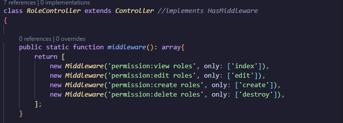

<h1 id="inicio">Implementando Permissões no Laravel 11</h1>

## Requisitos

https://youtube.com/playlist?list=PLRB0wzP8AS_GfoZTiqsY1397H8LcXgkMZ&si=d-B_vnTrxIk4d79E

- PHP 8+
- Composer
- MySQL ou SQLite
- Node.js e NPM (para o frontend, caso aplicável)

## Passo a Passo

### 1. Clonar o Projeto

```bash
git clone https://github.com/malobr/Permission-Laravel.git
cd seu-projeto
```

### 2. Instalar Dependências

```bash
composer install
npm install && npm run build
```

### 3. Configurar o Ambiente

Copie o arquivo de exemplo `.env` e configure suas credenciais de banco de dados:

```bash
cp .env.example .env
```

Gere a chave da aplicação:

```bash
php artisan key:generate
```

Configure suas credenciais no `.env`:

```
DB_CONNECTION=mysql
DB_HOST=127.0.0.1
DB_PORT=3306
DB_DATABASE=seu_banco
DB_USERNAME=seu_usuario
DB_PASSWORD=sua_senha
```

### 4. Criar o Banco de Dados e Rodar as Migrations

```bash
php artisan migrate --seed
```

### 5. Instalar e Configurar o Spatie Permissions

```bash
composer require spatie/laravel-permission
```

Publique a configuração:

```bash
php artisan vendor:publish --provider="Spatie\Permission\PermissionServiceProvider"
```

Rode as migrations:

```bash
php artisan migrate
```
### 6. Inicializar o Servidor

```bash
php artisan serve
```


### 7. Retire o comentário do `implements HasMiddleware` nos seguintes controllers:
### Seguindo o passo a passo...

**Importante: Antes de remover os comentários nos controllers, siga estas etapas:**

1. Rode o projeto e crie uma conta.
2. Faça o login na aplicação.
3. Crie as roles conforme as permissões já configuradas.
4. Atribua a role ao seu usuário.

Após esses passos, você pode remover os comentários, e os middlewares começarão a funcionar corretamente, aplicando as permissões de maneira eficaz.

EXEMPLO:



Retire os comentarios dos seguintes controllers:
- `ArticleController`
- `PermissionController`
- `RoleController`
- `UserController`


<a href="#inicio">Voltar ao início</a>
```
