<h3 id="inicio"></h3>

# Implementando Permissões no Laravel 11

### Requisitos
Para um entendimento melhor, aqui está o link da playlist em que o projeto foi baseado...
[Link da playlist](https://youtube.com/playlist?list=PLRB0wzP8AS_GfoZTiqsY1397H8LcXgkMZ&si=d-B_vnTrxIk4d79E)

- PHP 8+
- Composer
- MySQL ou SQLite
- Node.js e NPM (para o frontend, caso aplicável)

## Passo a Passo

### 1. Clonar o Projeto

```bash
git clone https://github.com/malobr/Permission-Laravel.git
cd backend
```

### 2. Instalar Dependências

```bash
composer install
npm install && npm run dev
```

### 3. Configurar o Ambiente

Copie o arquivo de exemplo `.env` e configure suas credenciais de banco de dados:

```bash
cp .env.example .env
```

Gere a chave da aplicação:

```bash
php artisan key:generate
```

Configure suas credenciais no `.env`:

```
DB_CONNECTION=mysql
DB_HOST=127.0.0.1
DB_PORT=3306
DB_DATABASE=seu_banco
DB_USERNAME=seu_usuario
DB_PASSWORD=sua_senha
```

### 4. Instalar e Configurar o Spatie Permissions

```bash
composer require spatie/laravel-permission
```

Publique a configuração:

```bash
php artisan vendor:publish --provider="Spatie\Permission\PermissionServiceProvider"
```

Ou, caso prefira...

```bash
php artisan vendor:publish --tag="permission-migrations"
```

### 5. Criar o Banco de Dados e Rodar as Migrations

```bash
php artisan migrate 
```

### 6. Rodar a Seed

```bash
php artisan db:seed --class=SuperAdminSeeder
```

Isso criará:

- Todas as permissões de todos os CRUDs.
- Uma role `superadmin` com todas as permissões.  
- Um usuário com e-mail `superadmin@teste.com` e senha `12345678`.  
- Esse usuário terá a role de `superadmin`.

### 7. Limpar o Cache e Inicializar o Servidor

```bash
php artisan config:clear
php artisan cache:clear
php artisan optimize:clear
php artisan serve
```

## Fluxo do Sistema

Agora que você configurou o projeto e as permissões, vamos visualizar o fluxo do sistema, com as etapas representadas por imagens.

1. **Dashboard inicial**
   - **Imagem 1**: Contém as informações de quem está logado.
   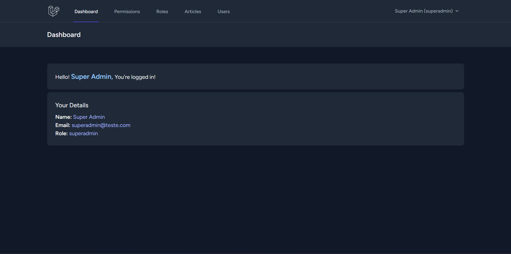

2. **Listagem das Permissões**
   - **Imagem 2**: Contém a listagem das permissões já geradas pela seed.
   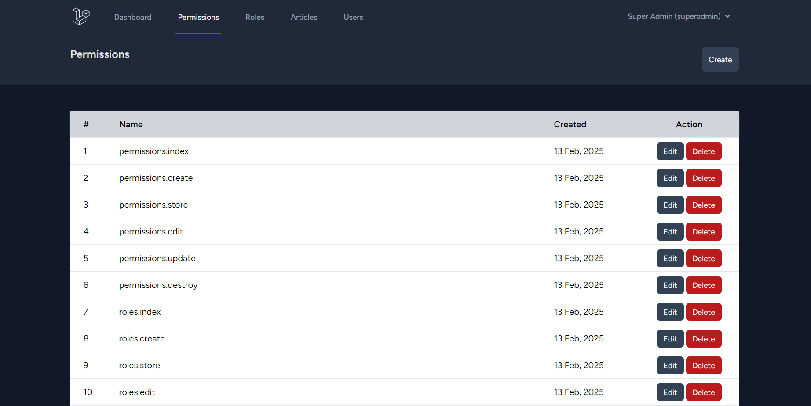

3. **Criação das Permissões**
   - **Imagem 3**: Criação das permissões. As permissões já estão predefinidas para o sistema. Para algo específico, crie-as no código.
   

4. **Edição das Permissões**
   - **Imagem 4**: Edição das permissões.
   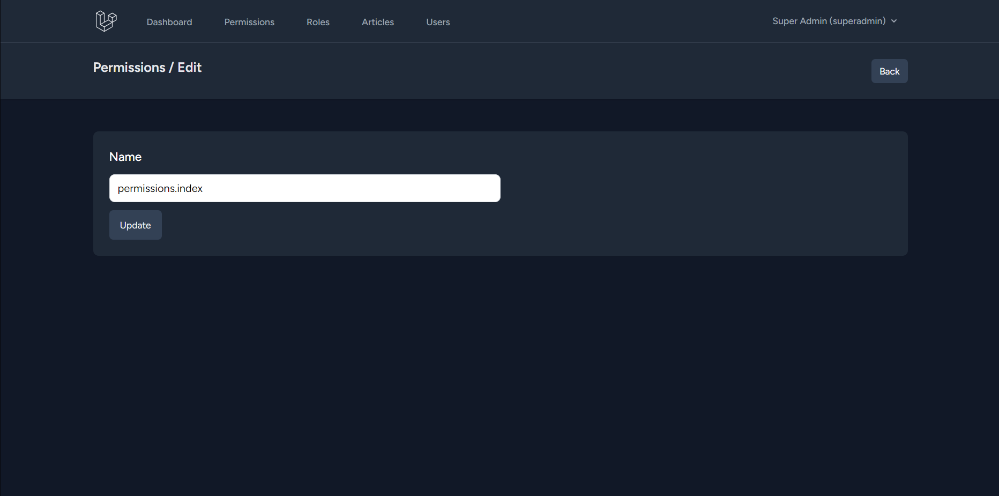

5. **Listagem das Roles**
   - **Imagem 5**: Listagem das roles existentes.
   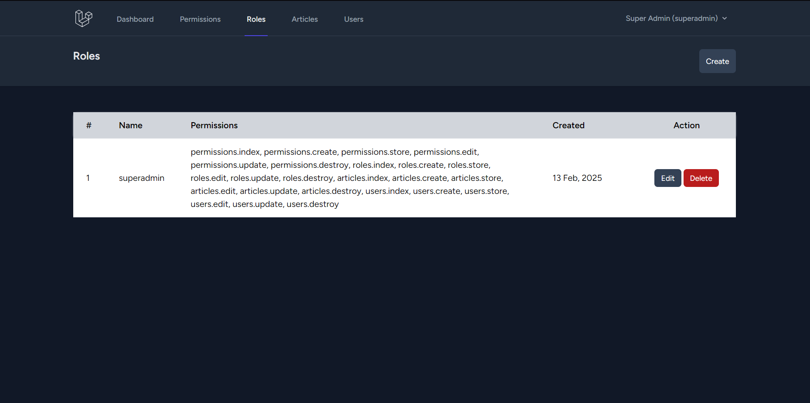

6. **Criação das Roles**
   - **Imagem 6**: Criação das roles atribuindo as permissões desejadas.
   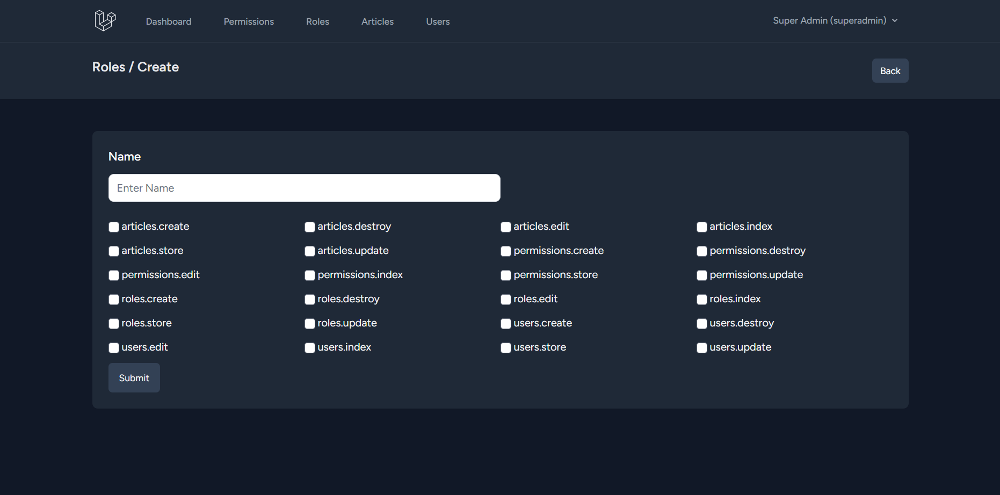

7. **Edição das Roles**
   - **Imagem 7**: Edição das roles, alterando suas permissões e seu nome.
   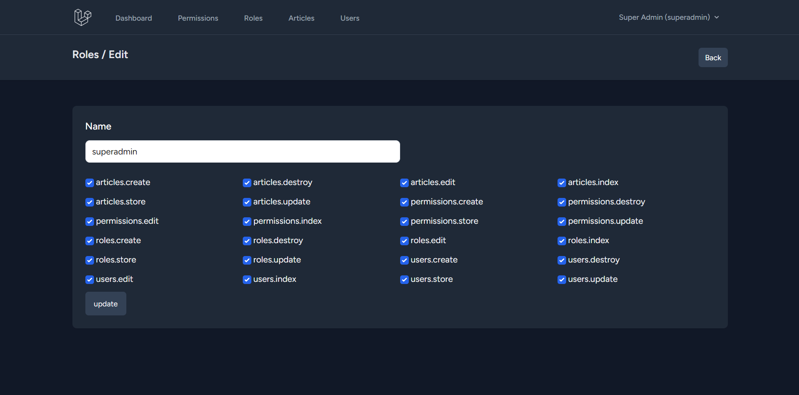

8. **Listagem de Artigos**
   - **Imagem 8**: Lista dos artigos.
   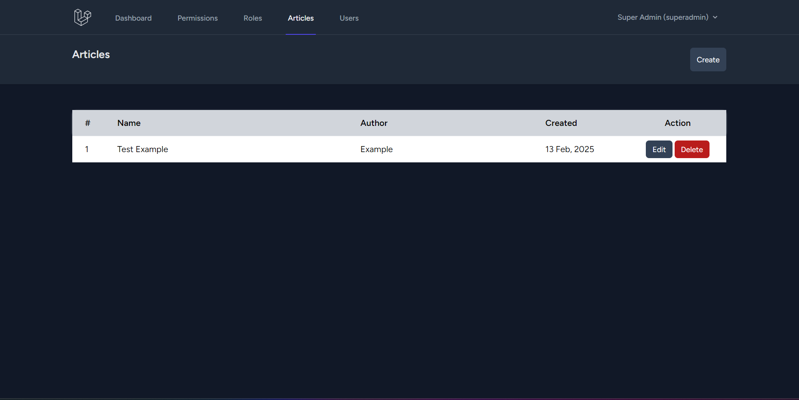

9. **Criação dos Artigos**
   - **Imagem 9**: Criação dos artigos, com título, texto e autor.
   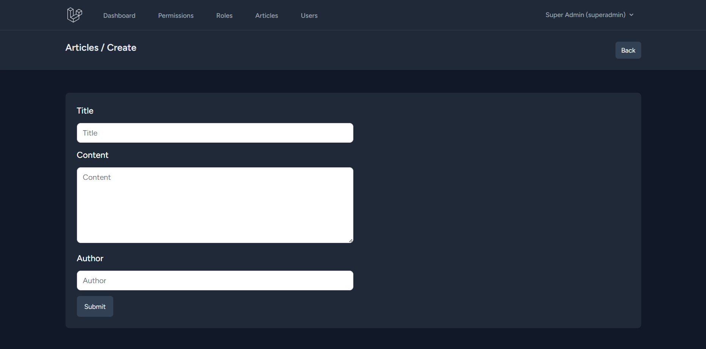

10. **Edição dos Artigos**
    - **Imagem 10**: Edição dos artigos, alterando seu título, conteúdo e autor.
    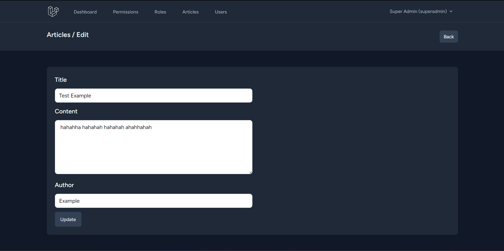

11. **Listagem de Usuários**
    - **Imagem 11**: Listagem dos usuários cadastrados.
    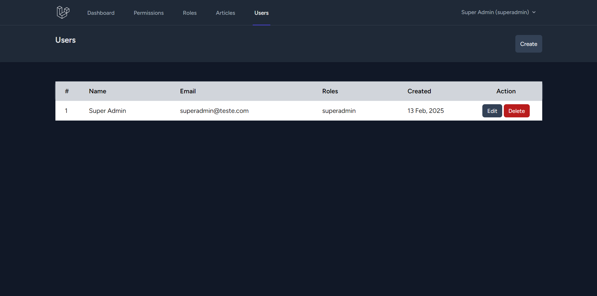

12. **Criação dos Usuários**
    - **Imagem 12**: Criação dos usuários com nome, e-mail e senha.
    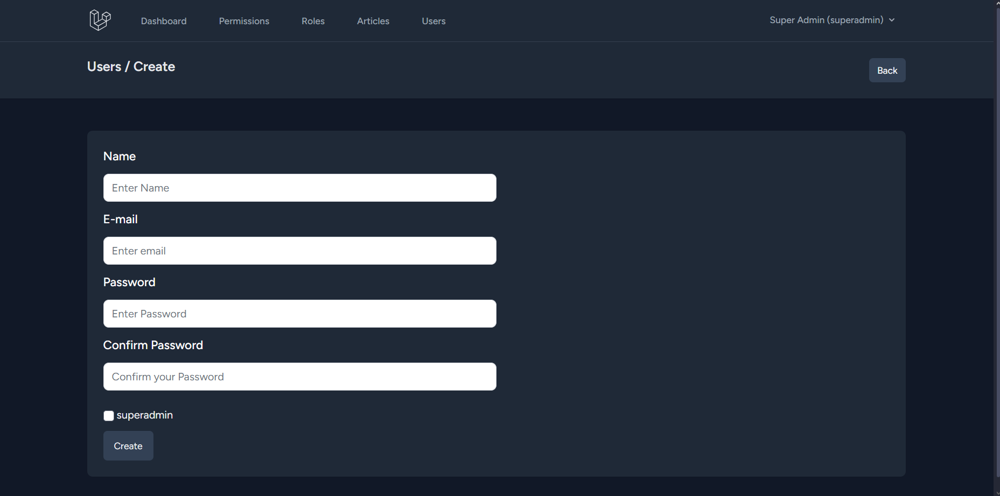

14. **Edição dos Usuários**
   - **Imagem 14**: Edição dos usuários, alterando seu nome, e-mail e role.
   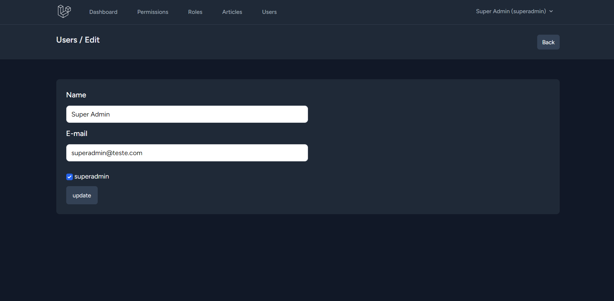

<a href="#inicio">Voltar ao início</a>
